<div align="center">

# 🧭 AttritionIQ

### Know who's about to leave — before they do.

**AttritionIQ** is an explainable machine-learning platform that predicts employee
turnover, reveals *why* each person is at risk, and hands your people team clear,
prioritised actions. It pairs a calibrated **CatBoost** model (with native SHAP
explanations) and a **FastAPI** service with a **Next.js** interface dressed in a
warm, tactile **claymorphism** design system.

<br/>


<br/>


<sub>▶ Prefer video? Watch the <a href="docs/media/walkthrough.mp4">full walkthrough (MP4)</a>.</sub>

</div>

---

## ✨ Highlights

|  | Feature | What it does |
|--|---------|--------------|
| 🎯 | **Risk scores, not guesses** | Every employee gets a calibrated **0–100% attrition probability**, not a bare yes/no. |
| 🔍 | **Explainable by design** | Native **SHAP** values show exactly which factors push each person toward leaving. |
| 🧑‍🤝‍🧑 | **One or thousands** | Score a single profile, or upload a roster CSV for an instant, sortable at-risk dashboard. |
| 💡 | **Actionable recommendations** | Each prediction ships with prioritised, human-readable retention actions. |
| 📊 | **Model transparency** | A built-in insights page surfaces live metrics, feature importance and model comparison. |
| 🎨 | **A UI that feels made** | A hand-built claymorphism design system with soft depth, motion and a warm palette. |

---

## 📸 A look inside

<table>
  <tr>
    <td width="50%">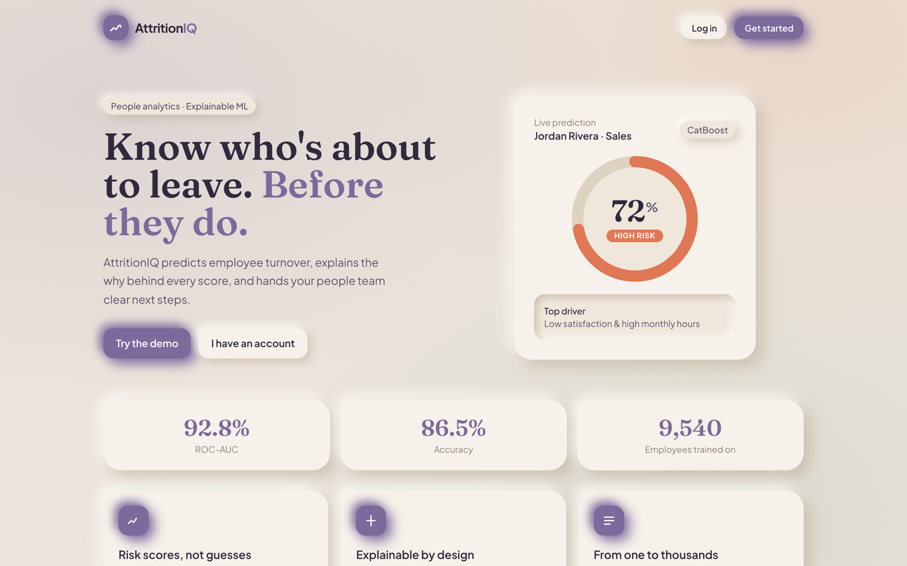<p align="center"><sub><b>Landing</b> — the pitch, with a live gauge</sub></p></td>
    <td width="50%">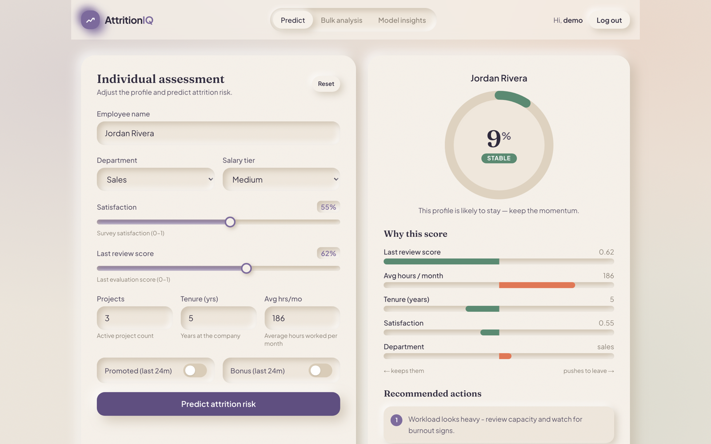<p align="center"><sub><b>Predict</b> — risk gauge, SHAP drivers & actions</sub></p></td>
  </tr>
  <tr>
    <td width="50%">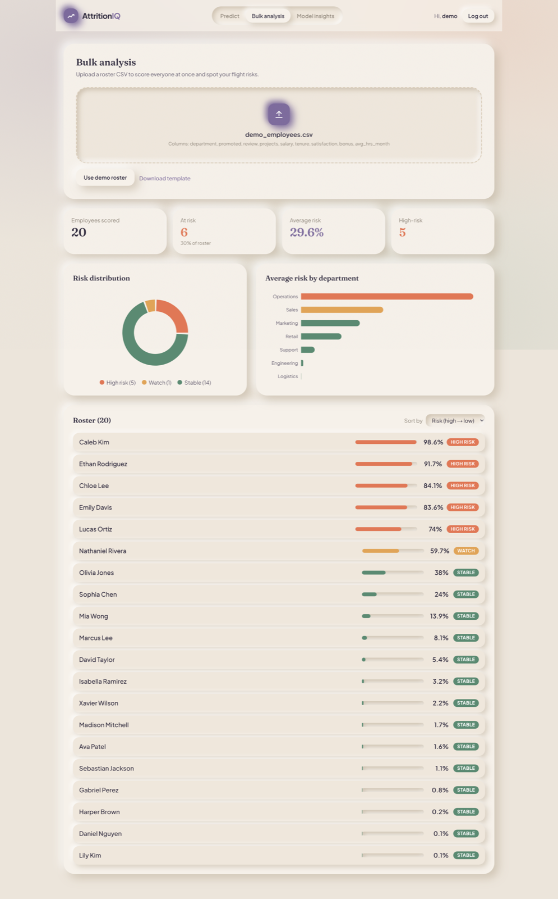<p align="center"><sub><b>Bulk analysis</b> — roster analytics & at-risk table</sub></p></td>
    <td width="50%">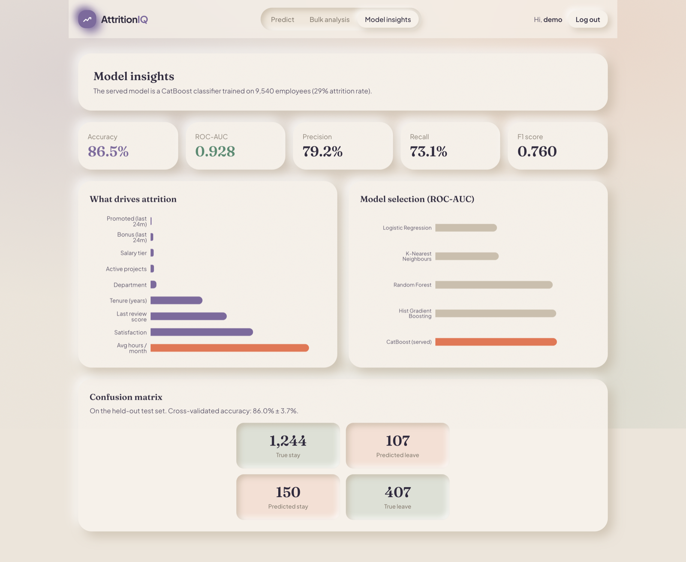<p align="center"><sub><b>Model insights</b> — metrics, drivers & confusion matrix</sub></p></td>
  </tr>
  <tr>
    <td width="50%">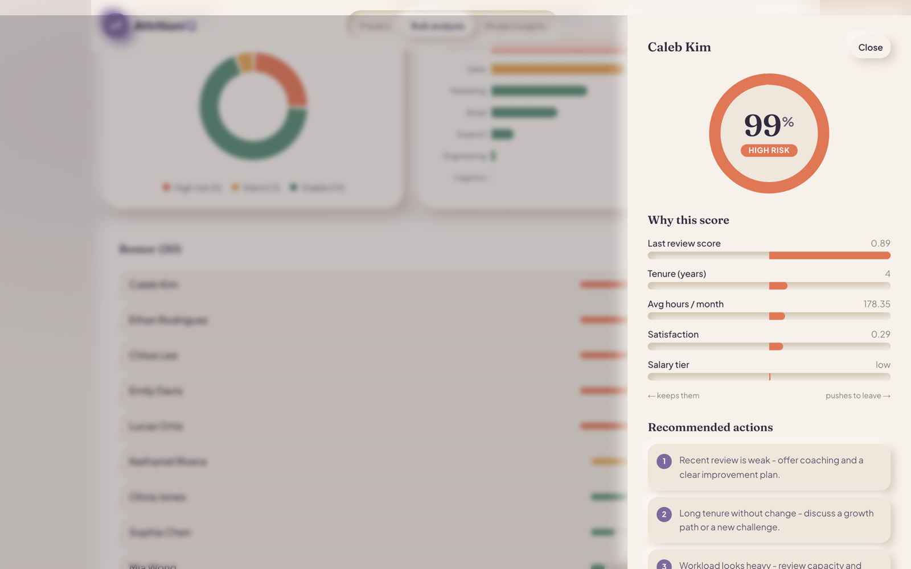<p align="center"><sub><b>Drill-down</b> — per-employee explanation drawer</sub></p></td>
    <td width="50%">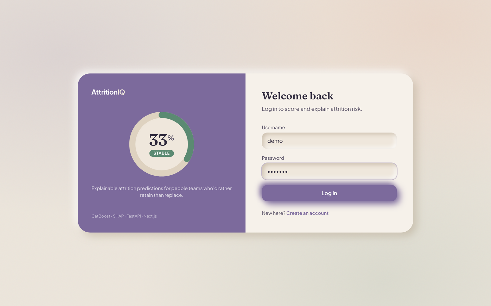<p align="center"><sub><b>Auth</b> — JWT-secured sign in / register</sub></p></td>
  </tr>
</table>

---

## 🤖 The model & research

AttritionIQ is trained on a dataset of **9,540 employees** with a **29.2%** attrition
rate. Categorical fields (department, salary tier) are handled natively by CatBoost —
no brittle manual encoding — and the served model exposes **per-prediction SHAP
values** so every score is explainable.

### Performance (held-out test set)

| Metric | Score |
|--------|:-----:|
| **Accuracy** | **86.5%** |
| **ROC-AUC** | **0.928** |
| Precision | 79.2% |
| Recall | 73.1% |
| F1 | 0.760 |
| Cross-validated accuracy | 86.0% ± 3.7% |

### Model selection

Five classifiers were benchmarked; **CatBoost** won on every headline metric and
became the served model.

| Model | Accuracy | ROC-AUC | F1 |
|-------|:--------:|:-------:|:--:|
| **CatBoost** ⭐ | **0.865** | **0.928** | **0.760** |
| Hist Gradient Boosting | 0.861 | 0.926 | 0.755 |
| Random Forest | 0.856 | 0.913 | 0.728 |
| K-Nearest Neighbours | 0.730 | 0.723 | 0.493 |
| Logistic Regression | 0.724 | 0.717 | 0.289 |

<table>
  <tr>
    <td width="33%">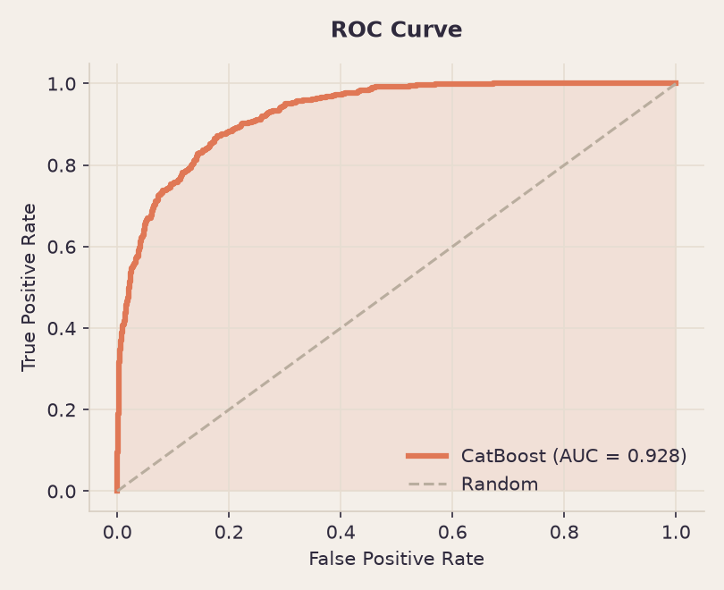</td>
    <td width="33%">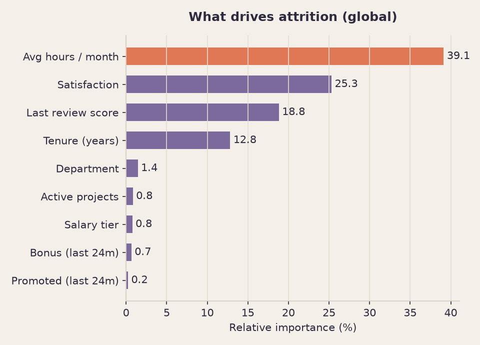</td>
    <td width="33%">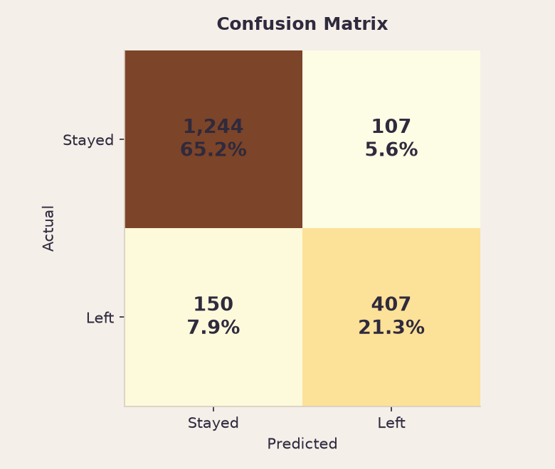</td>
  </tr>
  <tr>
    <td width="33%">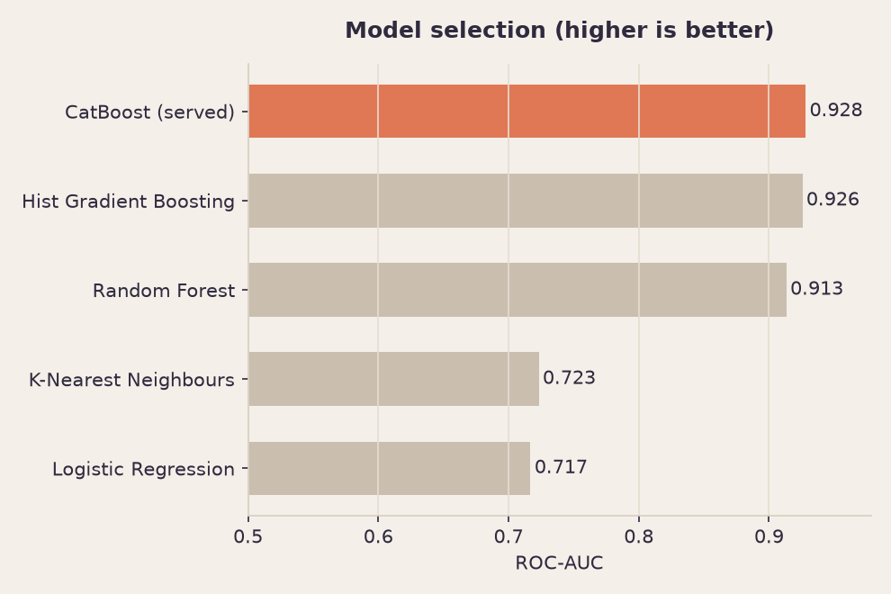</td>
    <td width="33%">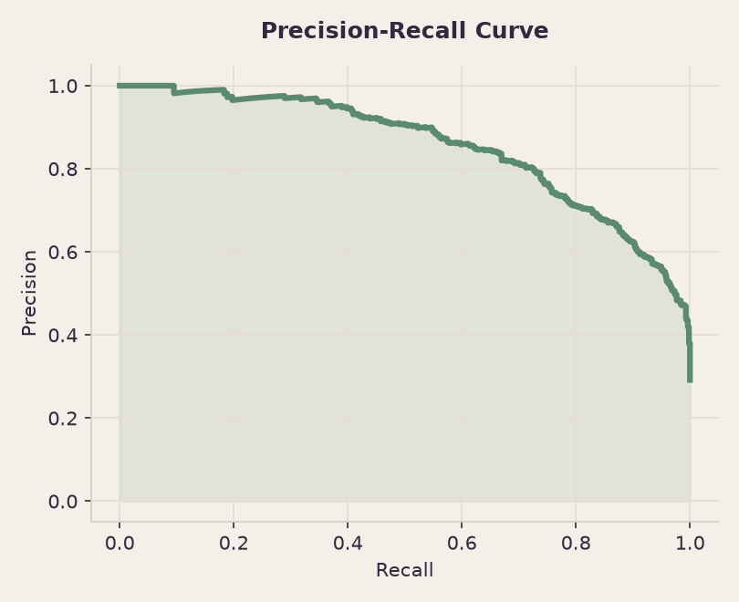</td>
    <td width="33%">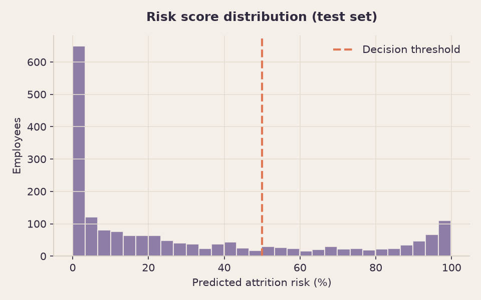</td>
  </tr>
</table>

> **Top drivers of attrition:** average monthly hours, satisfaction, and last review
> score together account for the majority of predictive signal — burnout and
> disengagement, quantified.

Everything above is reproducible: `python ml/train.py` retrains the model, regenerates
`metadata.json`, and re-renders every chart.

---

## 🏗️ Architecture

```
┌───────────────────────┐        /api/*         ┌──────────────────────┐
│      Next.js 14       │  ───────────────────▶ │      FastAPI         │
│  (App Router, TS)     │   JSON over HTTP      │   (Python 3.12)      │
│                       │ ◀───────────────────  │                      │
│  • Claymorphism UI    │                       │  • JWT auth          │
│  • Framer Motion      │                       │  • /predict          │
│  • Recharts           │                       │  • /predict/batch    │
│  • JWT in localStorage│                       │  • /model/info       │
└───────────────────────┘                       └───────────┬──────────┘
                                                            │
                                       ┌────────────────────┴───────────────┐
                                       │  CatBoost model + native SHAP        │
                                       │  SQLite (users)                      │
                                       └──────────────────────────────────────┘
```

---

## 🚀 Getting started

**Prerequisites:** Python 3.11+, Node.js 18+.

### 1 · Backend (FastAPI)

```bash
# from the repo root
python3 -m venv .venv
source .venv/bin/activate
pip install -r api/requirements.txt

# configure secrets
cp api/.env.example api/.env      # then edit SECRET_KEY

# (optional) retrain the model & regenerate charts
python ml/train.py

# run the API on :5001
cd api && ./run.sh
```

The API is now live at **http://127.0.0.1:5001** — interactive docs at `/docs`.

### 2 · Frontend (Next.js)

```bash
cd web
npm install
npm run dev
```

Open **http://localhost:3000**, create an account, and start predicting.
The frontend proxies `/api/*` to the backend, so there's nothing else to configure.

---

## 🔌 API reference

| Method | Endpoint | Auth | Description |
|--------|----------|:----:|-------------|
| `POST` | `/auth/register` | – | Create an account, returns a JWT |
| `POST` | `/auth/login` | – | Log in, returns a JWT |
| `POST` | `/predict` | 🔒 | Score one employee → risk %, SHAP drivers, recommendations |
| `POST` | `/predict/batch` | 🔒 | Upload a roster CSV → per-employee scores + aggregate analytics |
| `GET`  | `/model/info` | 🔒 | Live metrics, feature importance & model comparison |
| `GET`  | `/health` | – | Health check |

<details>
<summary><b>Example — <code>POST /predict</code></b></summary>

```json
// request
{
  "name": "Jordan Rivera",
  "department": "sales",
  "promoted": 0,
  "review": 0.35,
  "projects": 2,
  "salary": "low",
  "tenure": 9,
  "satisfaction": 0.2,
  "bonus": 0,
  "avg_hrs_month": 210
}

// response (abridged)
{
  "name": "Jordan Rivera",
  "risk": 91.7,
  "will_leave": true,
  "band": "high",
  "drivers": [
    { "label": "Satisfaction", "value": 0.2, "impact": 1.90, "direction": "increases" },
    { "label": "Avg hours / month", "value": 210, "impact": 1.10, "direction": "increases" }
  ],
  "recommendations": [
    "Satisfaction is low - schedule a 1:1 check-in and act on feedback.",
    "Workload looks heavy - review capacity and watch for burnout signs."
  ]
}
```
</details>

The demo roster used throughout the app lives at [`demo_employees.csv`](demo_employees.csv).

---

## 🗂️ Project structure

```
Employee_Turnover_Prediction/
├── api/                    # FastAPI backend
│   ├── app/
│   │   ├── routers/        # auth + prediction endpoints
│   │   ├── model.py        # CatBoost inference, SHAP, analytics
│   │   ├── model_artifacts/# trained model.cbm + metadata.json
│   │   └── main.py
│   ├── tests/              # pytest suite
│   └── requirements.txt
├── web/                    # Next.js + TypeScript frontend
│   └── src/
│       ├── app/            # routes: landing, auth, /app/{predict,bulk,insights}
│       ├── components/     # clay design system + charts
│       └── lib/            # api client, auth, types
├── ml/                     # training pipeline & dataset
│   ├── train.py            # reproducible training + charts
│   ├── schema.py           # single source of truth for features
│   └── employee_churn_data.csv
└── docs/media/             # screenshots, charts & walkthrough
```

---

## 🧪 Tests

```bash
source .venv/bin/activate
cd api && python -m pytest      # auth, single + batch prediction, model info
```

---

## 🛠️ Tech stack

**Frontend** · Next.js 14 (App Router) · TypeScript · Tailwind CSS · Framer Motion · Recharts
**Backend** · FastAPI · Pydantic · PyJWT · Passlib (bcrypt) · SQLite
**ML** · CatBoost · scikit-learn · pandas · NumPy · Matplotlib

---

## 🗺️ Roadmap

- [ ] What-if simulator (drag a factor, watch the risk move)
- [ ] Exportable PDF reports per team
- [ ] Historical tracking of risk over time
- [ ] Role-based access for managers vs. HR

---

<div align="center">
<sub>Built with care as an explainable people-analytics demo. Licensed under <a href="LICENSE">MIT</a>.</sub>
</div>
